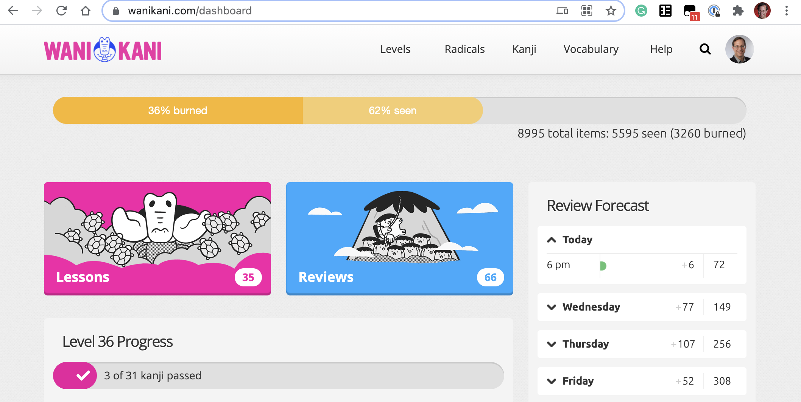

This is the initial release of the Burn Progress userscript. I borrowed most of the actual logic from @Pep95 's Total Progress Bar 9 userscript, but I tried to simplify the display significantly (exposing fewer details and using the default WK styling).

The script adds a gold-colored progress bar at the very top of the dashboard
showing your overall progress toward memorizing items with Wanikani:

The gold bar at the top indicates I’ve burned 36% of the 8,995 currently published items, and have “seen” (burned or am still in the process of reviewing) 62%.

I’m currently at level 36 of 60 (or 60% “done”) which is pretty close to the “seen” value shown above, but I prefer to think of myself as only 36% “done” since I’ve only burned about a third of the total items on Wanikani.

Heads up!
This is my very first userscript and has not been tested by anyone other than myself. It’s extremely likely I’ve screwed something up.

My strong advice is not to install this script until at least a few people have commented on this post without reporting any problems. I’ll update the script as problems are uncovered.

You’ve been warned.

 Installation
 Motivation
 Design, implementation, and explaining the output
 Bugs
Thanks
I’m particularly grateful to @Pep95, @Saimin, @Kumirei, and @rfindley for helping me create this script.

I’m an only sporadic programmer and it took me a while to build up my chops again. I’d never have succeeded without “borrowing” code from my betters.

I’d also like to give a shoutout to all the absolutely astonishing “free software” tools involved in building this:

Visual Studio Code
Git
Github
Tampermonkey
Greasyfork
MDN
HTML/CSS/Javascript
Wanikani API
Wanikani Open Framework
The fact that professional tools like these are freely available never ceases to amaze me.

Finally, thanks to Koichi, the team, and the terrific community here for keeping me motivated to improve my Japanese!